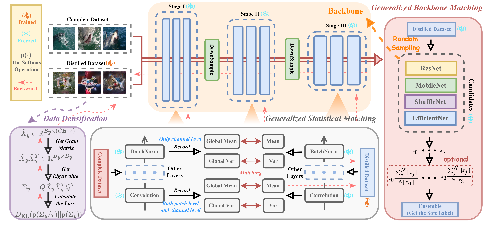
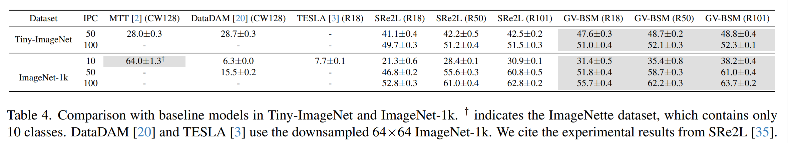
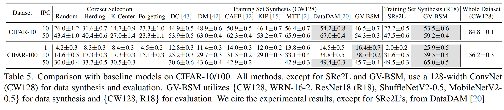
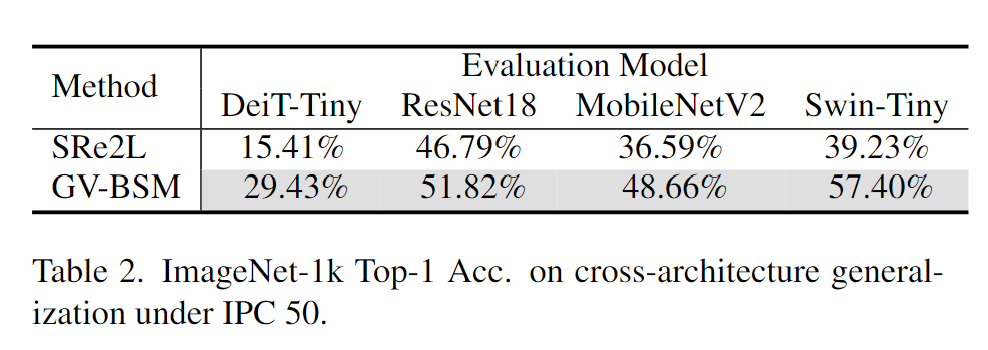

# G-VBSM

Offical Implementation of paper:

> **[Generalized Large-Scale Data Condensation via Various Backbone and Statistical Matching](https://arxiv.org/abs/2311.17950)** <br>

Authors:

>**<em>Shitong Shao, Zeyuan Yin, Muxin Zhou, Xindong Zhang</em> and <em>Zhiqiang Shen*</em>** <br>
> MBZUAI, Polyu and OPPO <br>
> *: Corresponding author

## Introduction

**(1) What is Dataset Condensation, or Dataset Distillation?**

Data Condensation, also known as Dataset Distillation, first introduced by Wang <em>et al.</em>, aims to alleviate the training burden by synthesizing a small yet informative distilled dataset derived from the complete training dataset, while ensuring that the behavior of the distilled dataset on the target task remains consistent with that of the complete dataset. The extremely compressed distilled dataset contain sufficiently valuable information and have the potential for fast model training, and have been become a popular choice for different downstream application, like federated learning, continual learning, neural architecture search and 3D point clouds.

**(2) It looks like Data Condensation is a very powerful algorithm with a lot of applications, so why has it never made it to the attention of the entire deep learning community?**

This is due to the overly expensive computational overhead of data synthesis. To be specific, Typical performance matching and trajectory matching unroll recursive computation graphs, requiring substantial GPU memory and resulting in prohibitive training costs. Zhao <em>et al.</em> proposed gradient matching to address this, synthesizing distilled datasets by matching gradients from synthetic and real data in a single step. However, gradient computation and matching remain time-consuming, leading to the proposal of distribution matching. This method and its variants employ a network-based feature extractor to embed both synthetic and real data into a high-dimensional Hilbert space, then perform distributional matching. The training load for this direct, single-step process stems only from one gradient update of the synthetic data and the feature extractor. Unfortunately, all of the above mentioned improved methods still have extremely large training overheads on the full 224x224 ImageNet-1k.

**(3) So are the above mentioned algorithms the only solutions for Data Condensation?**

No. Recently, SRe2L accomplished data condensation for the first time on the full 224x224 ImageNet-1k, achieving Top-1 validation accuracy 21.3% with ResNet18 under IPC 10. This method outperformed the latest state-of-the-art TESLA, which conducted on a low-resolution version of ImageNet-1k, by being 16x faster and improved performance by a margin of 13.6%. SRe2L is inspired by DeepInversion and aims to match statistics in BatchNorm generated from synthetic and real data. Meanwhile, it uses pre-trained models to obtain soft label to avoid the distilled dataset overfitting in the evaluation phase. This approach brings a novel perspective on Data Condensation.

**(4) Why can SRe2L be successful?**

SRe2L is essentially a data-free knowledge distillation algorithm, yet it is both effective and efficient on the full 224x224 ImageNet-1k. We suggest that SRe2L's core idea is perfroming "local-match-global" through BatchNorm. The "local-match-global" refers to utilizing more comprehensive information (<em>e.g.</em>, statistics in BatchNorm), generated from the model using the complete dataset (global), to guide the parameter update of the distilled dataset (local).

**(5) However, SRe2L cannot achieve the SOTA competitive on CIFAR-100. Meanwhile, SRe2L may have the potential for further performance improvements. Is this "local-match-global" format inferior to traditional algorithms?**

No. The efficiency of SRe2L cannot be matched by traditional methods. Since one efficient "local-match-global" matching is not enough, let's have two, three, or even countless! Until it outperforms traditional methods on CIFAR-100 with the traditional benchmark (which guarantees the model and the same number of epochs for evaluation). In addition, the generalization ability of the distilled dataset on ImageNet-1k will be further improved.

**(6) Therefore, we think Data Condensation just needs to follow "local-match-global".**

We empirically suggest that this perspective is not limited to the particular layer (<em>i.e.</em>, BatchNorm), model (<em>i.e.</em>, ResNet18), and statistical form (<em>i.e.</em>, channel mean and channel variance) used by SRe2L. Clearly, the distilled dataset is likely to perform consistently with the complete dataset on the evaluation model, provided there are sufficiently various matching statistical forms, backbone, and layers. We call this perspective as "generalized matching" and suggest that sufficient lightweight "local-match-global" matching can achieve and even surpass almost all traditional precise, yet single and expensive matching while remaining efficient.

**(7) Based on this, we propose Generalized Various Backbone Statistical Matching (G-VBSM)!**

<div align=left>

</div>

We propose Generalized Various Backbone and Statistical Matching (G-VBSM) in this work, which aims to create a synthetic dataset with densities, ensuring consistency with the complete dataset across numerous backbones, layers, and statistics. As experimentally demonstrated, G-VBSM is the first algorithm to obtain SOTA competitive performance on both toy and large-scale datasets: G-VBSM achieves the highest performance 38.7%, 47.6%, and 31.4% on CIFAR-100, Tiny-ImageNet, and the full 224x224 ImageNet-1k, respectively, under Images Per Class (IPC) 10, 50 and 10, respectively. These results surpass all SOTA methods by margins of 3.9%, 6.5%, and 10.1%, respectively. In particular, we reach the highest accuracy 29.4% and 57.4% on the unseen cross-architecture DeiT-Tiny and Swin-Tiny, respectively, on ImageNet-1k under IPC 50, outperforming the latest SOTA method SRe2L by margins of 14.0% and 18.2%.


## Method

<div align=left>

</div>

 G-VBSM consists of three core components: 1) Data Densification (DD), 2) Generalized Backbone Matching (GBM), and 3) Generalized Statistical Matching (GSM). In essence, G-VBSM employs the lightweight regularization strategy data densification (DD) to ensure both the diversity and density of the distilled dataset, ensuring that the potential of "generalized matching" can be fully exploited. Moreover, generalized backbone matching (GBM) and generalized statistical matching (GSM) are utilized to achieve "generalized matching" by performing "local-match-global" matching across various backbones, layers, and statistics.

## Experiment

### ImageNet-1k and Tiny-ImageNet:

<div align=left>

</div>

### CIFAR-10 and CIFAR-100:

<div align=left>

</div>

### Cross-Architecture Generalization:

<div align=left>

</div>


## Get Started

### Download

First, download our repository:

```bash
git clone https://github.com/shaoshitong/G_VBSM_Dataset_Condensation.git
```
This may take longer than the other repository downloads because we uploaded all the statistics for CIFAR-10/100, Tiny-ImageNet and ImageNet-1k.

### Installation

Our code can be easily run, you only need install following packages:
```bash
pip install numpy --pre torch torchvision torchaudio --force-reinstall --index-url https://download.pytorch.org/whl/nightly/cu118 # torch 2.0
pip install einops timm kornia tqdm wandb prefetch_generator scipy
```
Note that almost all versions of torch (>=1.9.0) will work, you do not necessarily install torch 2.0.

### Run

The implementation of different datasets are encapsulated in different directory: [CIFAR-10](./Branch_CIFAR_10), [CIFAR-100](./Branch_CIFAR_100), [Tiny-ImageNet](./Branch_Tiny_ImageNet) and [ImageNet-1k](./Branch_full_ImageNet_1k). After entering these directories, you can run:

```bash
cd squeeze
bash ./squeeze.sh # Only for CIFAR-10/CIFAR-100, Tiny-ImageNet. (Pre-trained Model Training Phase)

cd ../recover
bash ./recover.sh # (Data Synthesis Phase)

cd ../relabel
bash ./relabel.sh # (Soft Label Generation Phase)

cd ../train
bash ./train.sh # (Evaluation Phase)
```

**Note**: The code in each subfolder is essentially the same, modified only according to the corresponding dataset for ease of management.

### Details

**(1) Pre-training weights on CIFAR-10/100 and Tiny-ImageNet can be found in [pre-trained weight](https://github.com/shaoshitong/G_VBSM_Dataset_Condensation/releases/tag/v0.0.1).**

**(2) Tiny-ImageNet Downlaod**

First, download from [tiny-imagenet](http://cs231n.stanford.edu/tiny-imagenet-200.zip). And then, using the following code to adjust the val folder organization:

```python
import glob
import os
from shutil import move
from os import rmdir

target_folder = './tiny-imagenet-200/val/'

val_dict = {}
with open('./tiny-imagenet-200/val/val_annotations.txt', 'r') as f:
    for line in f.readlines():
        split_line = line.split('\t')
        val_dict[split_line[0]] = split_line[1]
        
paths = glob.glob('./tiny-imagenet-200/val/images/*')
for path in paths:
    file = path.split('/')[-1]
    folder = val_dict[file]
    if not os.path.exists(target_folder + str(folder)):
        os.mkdir(target_folder + str(folder))
        os.mkdir(target_folder + str(folder) + '/images')

for path in paths:
    file = path.split('/')[-1]
    folder = val_dict[file]
    dest = target_folder + str(folder) + '/images/' + str(file)
    move(path, dest)

rmdir('./tiny-imagenet-200/val/images')
```

Note that CIFAR-10/100 can be downloadeded by torchvision's API. Meanwhile, ImageNet-1k please follow [torchdistill-example](https://github.com/yoshitomo-matsubara/torchdistill/tree/main/examples/torchvision).

**(3) Compared with code in SRe2L, we have made some improvements:**

- [x] Data synthesis and evaluation phases can be trained in parallel.
- [x] Remove the configuration that the random number `seed` must be the same in soft label generation and evaluation phases.
- [x] Accuracy presentation on the training set is added in soft label generation phase.
- [x] Add `DataLoaderX` in [ImageNet-1k-Evaluation](.\Branch_full_ImageNet_1k\train\train_FKD_parallel.py) to accelerate training in evaluation phase.
- [x] TIMM package was added to evaluate on the unseen cross-architecture models `DeiT-Tiny` and `Swin-Tiny`.

**(4) In the future, what will we do?**

- [ ] Add the t-SNE and grid image visualization code.
- [ ] Fix some possible bugs.
- [ ] An algorithm will be designed to prune not important statistics to further ensure efficiency.


### Open Distilled Datasets

| Dataset\IPC | 1 | 10 | 50 | 100 |
| --- | --- | --- | --- | --- |
| ImageNet-1k | - | [image&label](https://pan.baidu.com/s/1CFmi32bUi9wADxU-DMxHSA) | [image](https://pan.baidu.com/s/1rLMCXZ82gwnczgzG6XVBpw) | [image](https://pan.baidu.com/s/1mTrjXNWm-mA-W0aMi4WtUw) |
| Tiny-ImageNet | - | - | [image](https://pan.baidu.com/s/1MA_aZqRsK4oN2aNTzD9NOQ) | [image](https://pan.baidu.com/s/1eUREErnSkvwLA0o0Ghc9pg) |
| CIFAR-100 | [image](https://pan.baidu.com/s/1yVjKvap2ggSWYdV0AMCaHA) | [image](https://pan.baidu.com/s/1hs5VVT3K0tHBJoxSHX6bAA) | [image](https://pan.baidu.com/s/1RYM6oIXBbs1MDBNfzunHvg) | - |
| CIFAR-10 | - | [image](https://pan.baidu.com/s/1HdcmX5ItgWCE-WdsTcKsSA) | [image](https://pan.baidu.com/s/1bHd-IhW6wJuBSMQ4eXkH3w) | - |

The baidu cloud's password is `2023`.


## Citation

If you find our code useful for your research, please cite our paper.

```
@article{shao2023generalized,
	title = {Generalized Large-Scale Data Condensation via Various Backbone and Statistical Matching},
	author = {Shitong Shao, Zeyuan Yin, Xindong Zhang and Zhiqiang Shen},
	year = {2023},
    journal = {arXiv preprint arXiv:2311.17950},
}
```

Our code based on SRe2L, MTT and Good-DA-in-KD:

```
@inproceedings{yin2023squeeze,
	title = {Squeeze, Recover and Relabel: Dataset Condensation at ImageNet Scale From A New Perspective},
	author = {Yin, Zeyuan and Xing, Eric and Shen, Zhiqiang},
	booktitle = {Neural Information Processing Systems},
	year = {2023}
}

@inproceedings{wang2022what,
    author = {Huan Wang and Suhas Lohit and Michael Jones and Yun Fu},
    title = {What Makes a "Good" Data Augmentation in Knowledge Distillation -- A Statistical Perspective},
    booktitle = {Neural Information Processing Systems},
    year = {2022}
}

@inproceedings{
cazenavette2022distillation,
    title = {Dataset Distillation by Matching Training Trajectories},
    author = {George Cazenavette and Tongzhou Wang and Antonio Torralba and Alexei A. Efros and Jun-Yan Zhu},
    booktitle = {Computer Vision and Pattern Recognition},
    year = {2022}
}
```